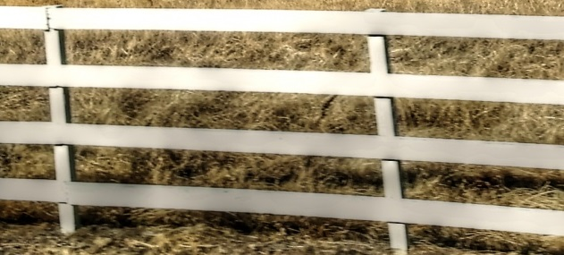

# Задания на квиз Мир Крипто 2024

## Разминка

### Кто царь?

**Стоимость:** 10

**Описание:** Какое искусство спасло Грецию от порабощения царём царей?

- [ ] Ораторское
- [ ] Театральное
- [x] Тайнопись
- [ ] Красноречие

---

### Николас Фламель реален?

**Стоимость:** 20

**Описание:** Описание чего пытался спрятать Арналдус де Брукселла в своём шифре?

- [ ] Системы шифрования
- [x] Философского камня
- [ ] Нового шифра
- [ ] Расположения войск

---

### П0г0в0рим?

**Стоимость:** 15

**Описание:** Распространенный стиль английского языка, которым наверняка пользовался каждый, также известный, как
хакерская речь.

- [x] Leet
- [ ] Транслит
- [ ] Lisp
- [ ] Разговорный

---

### Ну и кто теперь круут?

**Стоимость:** 20

**Описание:** 13 – это замечательное число, не так ли? Но всё-таки среди людей распространено мнение, что оно:

- [x] Hayhpxl
- [ ] Abqngn
- [ ] Djregl
- [ ] Lbhyvxrvg

---

### Точно два?

**Стоимость:** 10

**Описание:** Назовите российский блочный шифр двух людей и компании

- [ ] Калина
- [ ] Магма
- [ ] К.О.К.
- [x] Кузнечик

---

### А видели фильм?

**Стоимость:** 10

**Описание:** Какое устройство пытался взломать Тьюринг во время Второй мировой войны?

- [ ] The Turing machine
- [x] Enigma
- [ ] Bombe
- [ ] Bletchley

---

### Я требую…

**Стоимость:** 10

**Описание:** Где были сформулированы шесть конкретных требований к шифрам?

- [x] В книге «Военная криптография»
- [ ] В книге «Кабинет №40»
- [ ] В книге «Японские дипломатические секреты»
- [ ] В книге «Секретные произведения искусства, и никакой магии»

---

### Хм… А для чего?

**Стоимость:** 10

**Описание:**  Какова основная цель криптографии?

- [ ] Аутентификации отправителя сообщения
- [ ] Обеспечение целостности сообщения
- [x] Сохранение содержания сообщения в секрете
- [ ] Сжатие размера сообщения

---

### Назад в будущее

**Стоимость:** 10

**Описание:** Артефакты какой древней цивилизации свидетельствуют о первом применении шифрования?

- [ ] Древняя Греция
- [x] Древний Египет
- [ ] Спарта
- [ ] Древняя Индия

---

### Как же без него

**Стоимость:** 10

**Описание:** В чём заключается основная слабость шифра Цезаря?

- [ ] Подходит для шифрования только коротких сообщений
- [ ] Слишком сложный для реализации
- [ ] Медленный и неэффективный
- [x] Уязвимый для частотного анализа

---

### Великие математики

**Стоимость:** 15

**Описание:** Кто впервые предложил метод частотного анализа?

- [x] Аль-Кинди
- [ ] Аль-Хорезми
- [ ] Абу Камил
- [ ] Ибн Курра

---

### Древние Русы

**Стоимость:** 10

**Описание:** Одним из известных способов тайнописи в Древней Руси являлась замена букв, слогов, а иногда и целых слов
цифрами. Как называется этот способ?

- [ ] Тарабарщина
- [ ] Шифр Цезаря
- [x] Цифирь
- [ ] Литорея

---

### Эпоха Возрождения

**Стоимость:** 15

**Описание:**  Каково одно из выдающихся достижений Леона Баттисты Альберти в области криптографии?

- [ ] Он изобрел шифр Цезаря
- [x] Он разработал первый многоалфавитный шифр
- [ ] Он написал первую книгу по криптографии «Де Сифрис»
- [ ] Он взломал шифр Виженера

---

### Вперёд, автоматизация!

**Стоимость:** 15

**Описание:** Какой учёный создал изобретение, известное как колесо шифрования, состоящее из 36 буквенных колец на
движущихся колёсах?

- [ ] Джованни Баттиста Беллазо
- [ ] Иоганн Тритемий
- [ ] Леон Альберти
- [x] Томас Джефферсон

---

### Кто из них кто?

**Стоимость:** 10

**Описание:** Выберите из списка шифров только тот, который является симметричным

- [ ] RSA
- [x] Магма
- [ ] DSA
- [ ] ECDSA

---

### Без них нам никуда

**Стоимость:** 20

**Описание:** Некоторые криптографические алгоритмы находят широкое применение в компьютерных сетях для установления
безопасного соединения между устройствами. Назовите метод шифрования, использующийся в протоколе транспортного уровня
TLS, защищающий данные во время их передачи

- [ ] Шифр Цезаря
- [ ] RSA
- [x] SHA-256
- [ ] Магма

---

### Дальнейшее развитие

**Стоимость:** 20

**Описание:** В скором будущем у обычных пользователей начнут появлятся новые сверхбыстрые квантовые компьютеры.
Повлияет ли их использование на дальнейшее развитие криптографии?

- [ ] Нет, все современные способы криптографии надежны от “квантового взлома”
- [ ] Да, ни один из современных способов криптографии не является надежным при применении “квантового взлома”
- [ ] Да, современные симметричные шифры подвержены “квантовому взлому”
- [x] Да, несмотря на устойчивость современных симметричных шифров к “квантовому взлому”, асимметричные шифры являются
уязвимыми для него

---

### Страны-реформаторы

**Стоимость:** 15

**Описание:** Какая страна является лидером в разработке систем квантовой криптографии?

- [x] Китай
- [ ] Япония
- [ ] США
- [ ] Германия

---

### Зачем все это нужно?

**Стоимость:** 20

**Описание:** Какое допущение, используемое в популярных методах шифрования, не будет являться проблемой для квантового
компьютера?

- [ ] Злоумышленник не знает какой алгоритм шифрования используется для передачи сообщения
- [x] Вычислительной способности злоумышленника не хватает для дешифровки сообщения
- [ ] Злоумышленник не имеет физического доступа к каналу передачи данных
- [ ] Злоумышленник не имеет доступа к ключам шифрования

---

### Идея!

**Стоимость:** 15

**Описание:** На чём основан принцип квантовой криптографии?

- [ ] На математических алгоритмах
- [ ] На физических свойствах электронов
- [ ] На свойствах конкретных химических элементах
- [x] На физических свойствах фотонов

---

## Матрешки

### Засекреченные связи ч.1 Кто автор?

**Стоимость:** 30

**Описание:** Кто автор этой картины.


**Формат ответа:** Имя_Фамилия

**Ответ:** Мияги_Ётоку

**Решение:** Воспользуемся поиском по фото и узнаем, что автор картины японский художник Мияги Ётоку

---

### Засекреченные связи ч.2 Связующее звено

**Стоимость:** 30

**Описание:** С каким советским агентом работал автор картины из прошлого задания?

**Ответ:** Рихард_Зорге / Ика_Зорге

**Формат ответа:** Имя_Фамилия.

**Решение:** Любая информация, полученная из поискового запроса “Мияги Ётоку” отсылает нас к Зорге

---

### Засекреченные связи ч.3 Почти как Beatles.

**Стоимость:** 40

**Описание:** Под каким псевдонимом он руководил группой разведчиков?

**Ответ:** Рамзай

**Формат ответа:** Слово

**Решение:** Прочитав информацию про Рихарда Зорге, можно практически сразу узнать про его резидентуру в Японии под
кодовым названием “Рамзай”.

---

### Засекреченные связи ч.4 Статистика!

**Стоимость:** 40

**Описание:** С помощью какой книги они шифровали свои сообщения?

**Формат ответа:** Слово_слово_год

**Ответ:** Статистический_ежегодник_1935

**Решение:** По запросу “с помощью какой книги Рамзай шифровали свои сообщения” мы можем найти Немецкий статистический
ежегодник за 1935 год.

---

### Загадка века ч.1 13 17

**Стоимость:** 30

**Описание:** Жизненный цикл какого насекомого связан с этими числами?

**Формат ответа:** Слово

**Ответ:** Цикада

**Решение:** По запросу “жизненный цикл 13 и 17 какое насекомое”, можно найти информацию о периодических цикадах, откуда
и ответ.

---

### Загадка века ч.2 Кто за этим стоит?

**Стоимость:** 30

**Описание:** Какая организация связана с насекомым из прошлого задания?

**Формат ответа:** Название

**Ответ:** Cicada3301 / Цикада3301 / Цикада_3301 / Cicada_3301

**Решение:** По запросу “организация загадка интернета цикада”, можно найти информацию о Cicada 3301, откуда и ответ

---

### Загадка века ч.3 Good luck.

**Стоимость:** 40

**Описание:** Когда была опубликована первая загадка?

**Формат ответа:** дд.мм.гггг

**Ответ:** 05.01.2012

**Решение:** По запросу “когда была опубликована первая загадка cicada 3301”, можно найти ответ в явном виде

---

### Загадка века ч.4 Winner?

**Стоимость:** 40

**Описание:** Кто разгадал все загадки организации в 2012 году?

**Формат ответа:** Имя_Фамилия

**Ответ:** Маркус_Уоннер / Marcus_Wanner

**Решение:** По запросу “Кто разгадал все загадки Cicada 3301 в 2012 году”, можно найти ответ в явном виде.

---

### От прошлого к будущему ч.1 Это Спарта

**Стоимость:** 30

**Описание:** Какой инструмент шифрования изображён на фото?


**Формат ответа:** Название

**Ответ:** Скитала / Сцитала / Scytale

**Решение:** Осуществить поиск по картинке или сформировать запрос о шифровании в Древней Спарте

---

### От прошлого к будущему ч.2 По совместительству - криптоаналитик

**Стоимость:** 40

**Описание:** Кто взломал инструмент из предыдущего задания?

**Формат ответа:** Имя

**Ответ:** Аристотель

**Решение:** По запросу “Кто взломал скиталу” можно найти ответ в явном виде

---

### От прошлого к будущему ч.3 Символ организации

**Стоимость:** 50

**Описание:** Символом какой организации стал данный инструмент?

**Формат ответа:** Слово_слово_слово

**Ответ:** Американская_Ассоциация_Криптограмм / American_Cryptogram_Association

**Решение:** Изучив статью о скитале на Википедии, можно найти ответ в явном виде.

---

### От прошлого к будущему ч.4 Направление деятельности

**Стоимость:** 60

**Описание:** В каком направлении криптологии осуществляется работа данной организации?

**Формат ответа:** Слово

**Ответ:** Криптоанализ

**Решение:** Изучив статью об ААК на Википедии, можно найти ответ в явном виде

---

### Тайны престола ч.1 Пленная королева

**Стоимость:** 30

**Описание:** Портрет какого исторического деятеля изображен на фото?


**Формат ответа:** Имя_Фамилия

**Ответ:** Мария_Стюарт

**Решение:** Осуществить поиск по фото

---

### Тайны престола ч.2 В таком деле без шифров не обойтись

**Стоимость:** 40

**Описание:** Какой шифр использовался правителем из предыдущего задания?

**Формат ответа:** Слово_слово_слово

**Ответ:** Шифр_простой_замены

**Решение:** Изучить статьи о тайной переписке Марии Стюарт

---

### Тайны престола ч.3 Да восторжествует католицизм в Англии!

**Стоимость:** 50

**Описание:** Как назывался заговор, в рамках которого осуществлялась зашифрованная переписка с участием этой королевы?

**Формат ответа:** Слово_слово

**Ответ:** Заговор_Ридольфи

**Решение:** Изучив статью о Марии Стюарт на Википедии, можно найти ответ в явном виде

---

### Тайны престола ч.4 Всё тайное становится явным

**Стоимость:** 60

**Описание:** С помощью данного метода криптографического анализа английская разведка расшифровала письма участников
данного заговора, в результате чего изменники были казнены. О каком методе идёт речь?

**Формат ответа:** Слово_слово

**Ответ:** Частотный_анализ

**Решение:** По запросу “Как были расшифрованы письма Марии Стюарт” можно найти статьи, в которых содержится ответ в
явном виде

---

## События

### Самая небольшая большая ошибка

**Стоимость:** 30

**Описание:** 2014 заставил сердце криптографии обливаться кровью, из-за чего?

**Формат ответа:** слово

**Ответ:** Heartbleed

**Решение:**

---

### ЖВГВФАОКфН

**Стоимость:** 30

**Описание:** 19 января 1835 года родился человек, изменивший криптографию, скажите, что он сформулировал в своей книге.

**Формат ответа:** слово

**Ответ:** принципы

**Решение:** По запросу «кто родился 19 января 1835 года известный в криптографии» находим Керкгоффса, затем по запросу
«что сформулировал Керкгоффс» находим ответ.

---

### Рим. Генштаб

**Стоимость:** 30

**Описание:** Кто телеграфировал в Рим 2 ноября 1894 по делу Дрейфуса?

**Формат ответа:** Имя_Фамилия

**Ответ:** Александр_Паницари

**Решение:** В интернете находим информацию по делу Дрейфуса и по дате определяем личность телеграфирующего.

---

### Ворон

**Стоимость:** 30

**Описание:** Благодаря этому человеку, 21 июня 1843 года литературный криптоанализ был основан, кто он?

**Формат ответа:** Имя_Имя_Фамилия

**Ответ:** Эдгар_Аллан_По

**Решение:** Находим какая книга была опубликована 21 июня 1843 года, по ней и узнаём ответ.

---

### Квантовый протокол

**Стоимость:** 30

**Описание:** В 1984 году Чарльз Беннетт и Жиль Брассар разработали первый протокол квантовой криптографии. Как
называется этот протокол?

**Формат ответа:** Название

**Ответ:** BB84

**Решение:** находим работы Чарльза Беннета и Жиль бассара в 1984 г в области квантовой криптографии, и узнаём ответ.

---

### PURPLE

**Стоимость:** 30

**Описание:** В 1940 году одна команда шифровальщиков впервые взломала японский шифр PURPLE machine. О какой команде
идет речь?

**Формат ответа:** Слово_слово_слово

**Ответ:** Служба_разведки_сигналов

**Решение:** находим информацию о шифре PURPLE, и узнаем кто впервые расшифровал его

---

### Невозможное возможно

**Стоимость: 30**

**Описание:  **В 1855 году выступая на стороне Англии в Крымской войне, Чарльз Бэббидж взломал этот шифр, обладающий
автоматическим ключом. Этот шифр называли «неразрушимым шифром» того времени. О каком шифре идет речь?

**Формат ответа:** Слово_слово

**Ответ:** Шифр_Виженера

**Решение:** ищем информацию о Чарльзе Бэббидже и его достижениях, где и узнаем о его взломе шифра Виженера в 1855 году

---

### Основы криптографии

**Стоимость: 30**

**Описание:** В 1917 г. Американец Эдвард Хеберн создал первую криптографическую роторную машину, объединив
электрические схемы с механическими частями этого устройства. Как называется это устройство?

**Формат ответа:** Слово_слово

**Ответ:** Печатная_машинка

**Решение:** ищем информацию о том, из каких основных элементов состоит шифровальная машина, и узнаём ответ.

---

### Послание со вкусом

**Стоимость: 40**

**Описание:** В 1945 году советские войска использовали крайне необычный способ передачи информации. С помощью чего им
удалось доложить, что они вышли к Балтийскому морю?

**Формат ответа:** Слово_слово_слово_слово

**Ответ:** Бутылка_с_солёной_водой / Бутылка_с_соленой_водой

**Решение:** ищем информацию о том, человеке, под командованием которого удалось выйти к Балтийскому морю, и узнаем о
методе, с помощью которого ему доложили об этом.

---

### Дьявольский шифр

**Стоимость: 40 **

**Вопрос:** Оказывается, даже дьяволу есть, что скрывать. Но оно и к лучшему, ведь из этого шифра с мрачным названием
получился очень популярный алгоритм шифрования. Назовите и сам шифр, и алгоритм, который появился благодаря этому шифру

**Формат ответа:** Название шифра_Название алгоритма

**Ответ:** Люцифер_DES / Lucifer_DES

**Решение:** Среди всех известных шифров ищем тот, который больше всего подходит к вопросу. Люцифер(от анг. Lucifer) - и
есть сам дьявол в честь которого и назван шифр. Развитие «Люцифера» привело к созданию
алгоритма [DES](https://ru.wikipedia.org/wiki/DES).

---

### Clipper

**Стоимость:** 30

**Описание:** Микросхема Clipper представляла из себя чипсет, предназначенный для шифрования голосового трафика в
мобильных телефонах. Поговаривают что в его разработке замешано АНБ. В чем была особенность данного чипа?

**Формат ответа:** Слово

**Ответ:** Бэкдор

**Решение:** ищем, информацию о чипе flipper, и узнаем по какому принципу он работает, и какой основной прием в нем
используется

---

### Квантовая криптография

**Стоимость:** 30

**Описание:** Для безопасной передачи результатов голосования во время парламентских выборов в Швейцарии в 2009 году
применяли квантовую криптографию. Для этого использовали технологию, разработанную компанией id Quantique, которая
позволяет передавать зашифрованные ключи по оптоволоконной сети с помощью фотонов. Преимущество шифрования в том, что
сигнал может принимать 3 состояния для кодирования, помимо привычных нам 0 и 1. А как называется такая единица
информации?

**Формат ответа:** Слово

**Ответ:** Кубит

**Решение:** В интернете найти какую нибудь статью про квантовую криптографию и ознакомиться с ней.
Например: [https://encyclopedia.kaspersky.ru/glossary/quantum-cryptography/](https://encyclopedia.kaspersky.ru/glossary/quantum-cryptography/)

---

### Коварная разведка

**Стоимость:** 50

**Описание:** Какой сговор сорвал криптограф нанятый в N году англичанином? Впоследствии этот англичанин воспользовался
письмами для своей победы.

**Формат:** Слово_слово

**Ответ:** Заговор_Бабингтона

**Решение:** Ищем по картинке - выясняем, что это монарх Британии Елизавета 1. Ищем сговоры, связанные с ней. Среди
выданных заговоров, ищем соответствующий описанию. Заговор раскрыл Френсис Уолсингем, который использовал заговор в
своих целях( казнил католическую претендентку на престол Марию Шотландскую). При поиске информации Френсисе Уолсингеме,
на английской версии Википедии находим информации о нанятом им криптографе.

---

### Причина квазивойны

**Стоимость:** 50

**Описание:** В 1777-1780 гг. французские агенты требовали взятки от американского правительства для нормализации
дипломатических отношений. В переписке между американскими делегатами во Франции и государственным секретарём США имена
этих агентов шифровались номенклатурами в виде латинских букв. Укажите название данного инцидента.

**Формат:** Слово_слово

**Ответ:** Дело_XYZ

**Решение:** По запросу “квазивойна между США и Францией” можно найти статью на Википедии, в которой содержится ответ в
явном виде.

---

### НеСовременная проблема

**Стоимость:** 40

**Описание:** “Ваша сеть небезопасна!”, xx.xx.01; Почему?

**Формат:** Аббревиатура(eng)

**Ответ:** WEP

**Решение:** В поисковик вводим: “проблема небезопасной сети в 2001”. Осмотрев ответ поисковика, делаем предположение,
что речь идет о сети wifi. Ища про безопасность wifi натыкается на наиболее распрастранённую защиту wifi - WEP. Читая
про проблемы WEP, находим, что 2001 был предложен способ его взлома

---

### Грандиозный скандал

**Стоимость:** 30

**Описание:** Кто был в центре скандала в 2013 году, который привёл к международному общественному резонансу по поводу
слежки и утечки данных?

**Формат:** Имя_Фамилия

**Ответ:** Эдвард_Сноуден

**Решение:** Ищем “события 2013 года”, и среди них ищем связанное с слежкой и утечкой данных. Если искать не на
Википедии, то очень быстро найдется нужная часть

---

### Руководящий документ

**Стоимость:** 60

**Описание:** Укажите номер документа, принятого в 2015 году, который расширил возможности применения квантовой
криптографии

**Формат ответа:** Номер

**Ответ:** 18033

---

### Испытание 10_2

**Стоимость:** 50

**Описание:** В прошлом веке некоторые правительственные чиновники и специалисты утверждали, что для взлома этого кода
требуется суперкомпьютер стоимостью в несколько миллионов долларов. Они оказались не правы, хватило обычного ПК. Что за
организация доказала это?

**Формат:** Аббревиатура(eng)

**Ответ:** EFF

**Решение:** Взбиваем в поисковик первое предложение из описания, и получаем наводку на шифр DES. Находим строки про
признание шифра ненадежным, там название организации. В качестве дополнительной проверки переводим число в названии
таска в 10-ую систему, получаем 2. Исследование по взлому DES так и называлось: DES Challenge II

---

### 5-летнее соревнование

**Стоимость:** 40

**Описание:** Кто победил в “гонке” сх-3?

**Формат:** название(eng)

**Ответ:** keccak

**Решение:** Взбиваем в поисковик “сх-3 в криптографии”, получаем функцию хеширования SHA-3. Открыв статью Википедии про
SHA-3, находим, что победителем конкурса стал keccak. Для большей уверенности, можно найти статью посвященную этому
самому конкурсу.

---

### Золотая монета

**Стоимость:** 30

**Описание:** Как называется алгоритм шифрования, составная часть изобретения, которого через некоторое время после
создания всколыхнула весь мир и ускорила развитие криптографии?

**Формат:** аббревиатура(eng)

**Ответ:** ecdsa

**Решение:** Сопоставляем описание(изобретение ускорившее развитие криптографии) и название тачка(золотая монета). Путем
расспрашивания поисковика выясняем, что имеется ввиду первая криптовалюта - Биткойн. Заходим на статью Википедии и
находим там алгоритм шифрования.

---

### Ограниченные рамки

**Стоимость:** 30

**Описание:** Когда США появилась система, внедрившая криптографию в чёткие рамки?

**Формат:** гггг

**Ответ:** 1901

**Решение:** Четкие рамки можно перефразировать как стандарт. При запросе стандарты криптографии США находим либо DES,
либо FIPS 140-2, но везде фигурирует NIST. Заходим на статью про NIST - дата основания: 1901

---

## Даты

### Шифропанки

**Стоимость: 30**

**Вопрос:** В какой именно день состоялась публикация документа, затрагивающего вопросы охраны конфиденциальности в
интернете?

**Формат ответа:** дд.мм.гггг

**Ответ:** 09.03.1993

**Решение:** 

---

### Черные черные кабинеты

**Стоимость: 30**

**Вопрос:** В каком веке началась эра “Черных кабинетов” - период, когда появились специальные государственные органы по
перехвату, перлюстрации и дешифрованию переписки (в первую очередь, дипломатической)?

**Формат ответа:** век

**Ответ:** XVII

**Решение:** ищем информацию об эпохе “черных кабинетов” и узнаем даты ее существования.

---

### Первые успехи

**Стоимость: 30**

**Вопрос:** Когда произошел первый взлом “Энигмы”?

**Формат ответа:** мм.гггг

**Ответ: 12.1932**

**Решение:** ищем информацию о первом взломе энигмы, и узнаем дату

---

### День криптографической службы России

**Стоимость: 30**

**Вопрос:** Когда произошло событие, ставшее толчком для появления самого главного праздника русских криптографов?

**Формат ответа:** дд.мм.гггг

**Ответ:** 05.05.1921

**Решение:** 5 мая 1921 года Советом народных комиссаров РСФСР было принято постановление о создании криптографической
службы

---

### Чудесная метла или коварный план США

**Стоимость:** 30

**Вопрос:** В каком году изобрели чипсет flipper, с помощью которого США, чуть не получила доступ ко всем персональным
данным по всему миру?

**Формат ответа:** гггг

**Ответ:** 1993

**Решение:** ищем какую-нибудь статью про чип flipper и узнаем год его создания

---

### Инструмент для считывания

**Стоимость:** 50

**Описание:** В каком году до нашей эры поэт впервые упомянул шифр?


**Формат:** год

**Ответ:** 650

**Решение:** Ищем в поисковике по картинке. Выдает статью в Википедии про музей, либо же на самого поэта. В любом случае
везде можно найти имя “Архилох”. Забив в поисковик “Архилох и шифры” получаем упоминание древнегреческого шифра
«Скитала». В статье на Википедии про нее находим представленное изображение, а под ним - ответ на вопрос

---

### Advanced Encryption Standard

**Стоимость:** 30

**Описание:** В каком году стандарт шифрования AES был утверждён правительством США как официальный?

**Формат ответа:** гггг

**Ответ:** 2001

**Решение:** Изучив статью на Википедии о AES можно найти ответ в явном виде.

---

### Инцидент “Пуэбло”

**Стоимость:** 50

**Описание:** В результате захвата силами КНДР американского разведывательного судна “Пуэбло” северокорейская и
советская криптослужбы получили важные материалы и аппаратуру, в частности американские шифраторы «KW-7», «KL-7»,
«KL-47», «KW-26» и «KW-37», а также ключи к ним. Укажите дату этого события.

**Формат ответа:** дд.мм.гггг

**Ответ:** 23.01.1968

**Решение:** По запросу “инцидент Пуэбло” можно найти статьи, содержащие ответ в явном виде.

---

### На пороге войны

**Стоимость:** 40

**Описание:** В каком году было запущено серийное производство первой шифровальной машины в СССР?

**Формат ответа:** гггг

**Ответ:** 1938

**Решение:** По запросу “первая шифровальная машина в СССР” можно найти статьи, содержащие ответ в явном виде.

---

### Академия криптографии

**Стоимость:** 30

**Описание:** В каком году в России была создана Академия криптографии?

**Формат ответа:** гггг

**Ответ:** 1992

**Решение:** Изучив статью на Википедии об Академии криптографии РФ можно найти ответ в явном виде

---

### Криптослужба при Петре I

**Стоимость:** 40

**Описание:** Посольская Канцелярия - центр российской криптографической деятельности при Петре I. Её задачами были
шифрование и дешифрование дипломатических переписок, а также создание шифров и рекомендация по их использованию. В
ответе укажите год формирования Посольской Канцелярии как централизованного органа.

**Формат ответа:** гггг

**Ответ:** 1710

**Решение:** По запросу “посольская канцелярия” можно найти статью на википедии о Посольском приказе Петра I. В одной из
частей данной статьи идёт речь о Посольской Канцелярии, там же содержится ответ в явном виде.

---

### Новый правитель - новые шифры

**Стоимость:** 50

**Описание:** С приходом к власти Елизаветы Петровны были произведены реформы, в том числе и в области криптографии,
следствием которых стали новые требования к шифрам. Так, например, количество “пустышек” в одной строке стало
регламентироваться: “Пустые числа писать где сколько хочется, только чтобы на каждой строке было сих чисел не меньше
трех или четырех”. В ответе укажите годы, в которые были внесены данные реформы.

**Формат ответа:** гггг-гггг

**Ответ:** 1740-1750

**Решение:** Указав в поисковом запросе цитату: “Пустые числа писать где сколько хочется, только чтобы на каждой строке
было сих чисел не меньше трех или четырех”, можно найти статью, в которой содержится ответ в явном виде.

---

### Прародитель транспозиционных шифров

**Стоимость:** 40

**Описание:** В каком году Джероламо Кардано изобрёл инновационное по тем временам шифровальное устройство?

**Формат ответа:** гггг

**Ответ:** 1550

**Решение:** В статье на Википедии о Джероламо Кардано содержится информация о “решётке Кардано”. Изучив статью о ней,
можно найти ответ в явном виде.

---

### Grand Chiffre

**Стоимость:** 40

**Описание:** На протяжении нескольких столетий Великий Шифр Россиньоля считался невзламываемым, из-за чего и был
удостоен такого названия. Однако офицер французской армии Этьен Базери смог разгадать его тайну. В каком году он это
сделал?

**Формат ответа:** гггг

**Ответ:** 1893

**Решение:** По запросу “Этьен Базери великий шифр” можно найти статьи о взломе данного шифра, в которых содержится
ответ в явном виде.

---

### Шифровальные новшества

**Стоимость:** 30

**Описание:** В каком веке в России стали применяться алфавитные и неалфавитные коды?

**Формат ответа:** римская цифра

**Ответ:** XVIII

**Решение:** По запросу “история алфавитных и неалфавитных кодов в России” можно найти статьи, в которых содержится
ответ в явном виде.

---

### Предупреждён - значит вооружён

**Стоимость:** 40

**Описание:** Советскими криптоаналитиками были рассекречены телеграммы английского посла в России и дипломатического
агента, сменившего его. Это позволило ВЧК раскрыть заговор против “большевиков”. В каком году произошло это событие?

**Формат ответа:** гггг

**Ответ:** 1918

**Решение:** По запросу **“**заговор Великобритании против большевиков” можно найти статью на Википедии о деле Локкарта,
в которой содержится ответ в явном виде.

---

### Теперь по ГОСТу

**Стоимость:** 30

**Описание:** В каком году был разработан первый российский стандарт электронной цифровой подписи (ЭЦП)?

**Формат ответа:** гггг

**Ответ:** 1994

**Решение:** По запросу “история ЭЦП в России” можно найти статьи, в которых содержится ответ в явном виде.

---

### Популярный ключ

**Стоимость:** 40

**Описание:** В каком году был разработан первый вариант алгоритма, который в будущем стал первой пригодной системой и
для шифрования, и для цифровой подписи?

**Формат:** год

**Ответ:** 1969

**Решение:** Алгоритм RSA, который стал первой системой, пригодной и для шифрования, и для цифровой подписибыл изобретен
еще в 1969 году Британскими спецслужбами.

---

### Преемник дьявола

**Стоимость:** 30

**Описание:** В каком году алгоритм стал стандартом?

**Формат:** год

**Ответ:** 1977

**Решение:** В 1977 году стандарт шифрования DES (Data Encryption Standard), в основе которого лежит шифр Люцифер, был
утверждён правительством США как официальный.

---

### Pretty Good Privacy

**Стоимость:** 30

**Описание:** Pretty Good Privacy (PGP) - созданное Филиппом Циммерманом открытое ПО шифрования электронной подписи
сообщений и др. информации. В каком году оно было разработано?

**Формат ответа:** гггг

**Ответ:** 1991

**Решение:** Изучив статью на Википедии о PGP можно найти ответ в явном виде.

---

### Спонсор Real World Crypto

**Стоимость:** 30

**Описание:** В каком году была основана организация, логотип которой представлен на фото?


**Формат ответа:** гггг

**Ответ:** 1982

**Решение:** Осуществив поиск по картинке можно выяснить, что речь идёт о Международной ассоциации криптологических
исследований (МАКИ). Изучив статью на Википедии о МАКИ можно найти ответ в явном виде.

---

## Люди

### Швейцарская разведка

**Стоимость:** 40

Он был одним из основных разработчиков швейцарской роторной машины для шифрования военных сообщений, известной как NEMA.
Швейцарцы, опасаясь, что немцы и союзники смогут прочитать сообщения, передаваемые их шифровальными машинами Enigma,
усовершенствовали систему, использовав десять роторов вместо пяти. Система использовалась швейцарской армией и ВВС с
1947 по 1992 год. Как звали этого человека?

**Формат ответа:** Имя_Фамилия

**Ответ:** Хьюго_Хадвигер / Hugo_Hadwiger

**Решение:** В интернете ищем подробную информацию про швейцарскую разведку, где мы и найдем информацию про этого
человека

---

### Добро или зло?

**Стоимость:** 30

**Описание:** Антагонист whoami2014?

**Ответ:** MRX

**Решение:** Делаем запрос в интернете whoami2014, узнаем, что речь идет о фильме 2014 года “кто я”, а антагонистом
главного персонажа, у которого ник whoami, является хакер MRX.

---

### Кто бы мог подумать

**Стоимость:** 50

**Описание:** Помоги мне узнать, сторонним экспертом какого издательства являлся бездомный хакер?

**Формат ответа:** Слово_слово_слово

**Ответ:** New_York_Times

**Решение:** Как известно в 2002 году, Адриан Ламо добавил себя в список сторонних экспертов NY Times, информацию об
этом можно найти в интернете,
например: [https://www.kaspersky.ru/resource-center/threats/top-ten-greatest-hackers](https://www.kaspersky.ru/resource-center/threats/top-ten-greatest-hackers).

---

### Что мы знаем о них?

**Стоимость:** 40

**Описание:**


**Формат ответа:** Фамилия_Имя

**Ответ:** Масахиро_Хара / Masahiro_Hara

**Решение:** Сканируем qr код и видим на открывшейся странице вопрос: “Кто придумал qr код”, ищем ответ в интернете и
находим Масахиро Хара.

---

### Эпоха Ренессанса

**Стоимость:** 70

**Описание:** Среди множества имён, занимавшихся криптографией, тяжело найти женское имя. История почти не сохранила
сведений о женских «лицах криптографии». Но всё же отрывочные сведения доказывают, что и среди представительниц
прекрасного пола были криптографы. Так известно, что шифр, основанный на замене букв или буквенных сочетаний алфавита на
определённые символы, содержащий обманную «пустышку» (символ, которому не соответствует никакая буква) и использующий
кодовые обозначения, был придуман женщиной-криптографом для шифровки писем об освобождении своего мужа из плена
венецианцев. К какому древнему роду принадлежал её супруг?

**Формат ответа:** Слово

**Ответ:** Гонзага

**Решение:** По описанию алгоритма шифрования, узнаем имя Изабелла д’Эсте, которая является его создательницей. Изучая
её биографию, находим имя супруга - Франческо II Гонзага из синьориального (владетельного) рода наследных правителей
Мантуи Гонзага.

---

### Царь - криптограф?

**Стоимость:** 50

**Описание:** Как его только не называют: царь-реформатор, царь-первооткрыватель, царь-творец, Отец отечества,
царь-европеец, царь-военный… Но мало кто знает, что он внёс большой вклад в развитие криптографии в России. Наличие чего
стало новшеством в алгоритмах шифрования в России в период его правления? В ответе укажите одно слово во множественном
числе

**Формат ответа:** Слово

**Ответ:** Пустышки

**Решение:** Под данными в описании эпитетами в историю вошёл первый российский император Пётр I. Изучив его вклад в
криптографию, узнаем, что он сыграл ключевую роль в создании и развитии секретной криптографической службы и подготовке
первых специалистов-криптографов для государственной службы. А новшеством для российских шифров петровского времени
стало наличие во многих из них «пустышек».

---

### Взлом Энигмы

**Стоимость:** 60

**Описание:** Вы, наверное, знаете, что во время Второй мировой войны британский учёный Алан Тьюринг изобрёл машину
“Bombe” для взлома «Энигмы» - совершенной криптографической машины того времени. Но мало кто знает, что впервые Энигма
была взломана ещё задолго до этого польскими сотрудниками спецслужб. Перечислите в алфавитном порядке их фамилии.

**Формат ответа:** Фамилия_Фамилия_Фамилия_Фамилия

**Ответ:** Зыгальский_Ревклид_Реевский_Ружицкий

**Решение:** Находим информацию о первом задокументированном взломе Энигмы. Впервые шифр «Энигмы» удалось дешифровать в
польском «Бюро шифров» в декабре 1932 года. Четверо сотрудников разведки — Мариан Реевский, Ежи Ружицкий, Генрих
Зыгальский и Иоганн Ревклид — с помощью данных французской разведки, математической теории и методов обратной разработки
разработали специальное устройство для дешифровки закодированных сообщений.

---

### Кто же первый?

**Стоимость:** 50

**Описание:** Считается, что первой запатентованной криптографической машиной в мире является «Энигма» - изобретение
немецкого инженера Артура Шербиуса, первую версию которого он запатентовал в 1918 году. Но в истории известна другая
криптографическая машина, основанная на дисках, запатентованная на год раньше «Энигмы». Она не получила широкого
распространения из-за нестойкости зашифрованного сообщения. Но факт остаётся фактом. Кто же был её изобретателем?

**Формат ответа:** Имя_Фамилия

**Ответ:** Эдвард_Хеберн / Edward_Hebern

**Решение:** Находим информацию о первой криптографической машине. Везде говорится об “Энигме”. Тогда находим информацию
об первой запатентованной дисковой шифровальной машине. Узнаем про “Hebern Electric Code Machine” - первая
запатентованная дисковая шифровальная машина в истории. Её разработал американский изобретатель Эдвард Хеберн в 1917
году.

---

### «Расплата» за гениальность

**Стоимость:** 50

**Описание:** «Расплата» за гениальность - данное словосочетание относится ко многим гениальным учёным, композиторам,
художникам. Также оно применимо и к криптографу, который создал два новых криптоаналитических метода, дал толчок к
использованию многочисленных статистических инструментов в криптографии, что стало настоящим переворотом. Несмотря на
все свои достижения, сильно страдало его психическое здоровье. Так, например, учёного три раза госпитализировали с
приступом тяжёлой депрессии. О ком идёт речь?

**Формат ответа:** Имя_Фамилия

**Ответ:** Уильям_Фридман / William_Friedman

**Решение:** Находим информацию об ученом, который создал два новых криптоаналитических метода, использовал
статистические инструменты в криптографии. Узнаём, что им был американский криптограф, именуемый «отцом американской
криптологии» Уильям Фридман.

---

### Шифры советских разведчиков

**Стоимость:** 30

**Описание:** Как известно, в СССР разные разведывательные группы использовали свои уникальные способы шифрования. Они
представляли из себя так называемые «ручные шифры», разработка которых значительно опережала общемировой уровень
развития криптографии в этой области. Так, например, в качестве ключа построения шахматного шифра использовалось слово
SUBWAY. Ключ выписывался в верхней строке квадратной таблицы. А в оставшиеся клетки по порядку проставлялись буквы
английского алфавита, не вошедшие в ключ. Затем нумеровались входящие в анаграмму буквы в таблице по порядку сверху вниз
и получалась новая таблица. Именно по ней происходило шифрование. Его псевдоним легко узнать по названию шифра, а
сможете назвать его настоящее имя?

**Формат ответа:** Имя

**Ответ:** Ика

**Решение:** По описанию алгоритма находим его название - шифр Рамзая. Его использовал руководитель японской резидентуры
ГРУ “Рамзай” Рихард Зорге (Ика Зорге), находясь на задании в Японии.

---

### Ключевая фигура на заднем плане

**Стоимость:** 60

**Описание:** Как звали криптографа, который работал на гения шпионажа?


**Формат:** Имя_Фамилия

**Ответ:** Томас_Филлипс

**Решение:** Осуществляем поиск по фото и выходим на страницу Википедии про англиканскую церковь. Ищем "Гений шпионажа
протестант" и находим страницу Википедии про Фрэнсиса Уолсингема. Ищем "криптограф, работавший на Фрэнсиса Уолсингема”

---

### Портрет на почтовой марке

**Стоимость:** 50

**Описание:** Портрет какого криптографа изображен на советской марке?


**Формат:** Фамилия_Имя_Отчество

**Ответ:** Шиллинг_Павел_Львович

**Решение:** Осуществляем поиск по фото и выходим на страницу Википедии с биографией П. Л. Шиллинга

---

### “Мне этого не нужно”, - говорил он

**Стоимость:** 50

**Описание:** Кто из российских правителей отказывался читать выписки из перлюстрированных писем?

**Формат:** Имя_римская цифра

**Ответ:** Александр_III

**Решение:**  Изучив историю чёрных кабинетов в России можно найти статьи, содержащие ответ в явном виде.

---

### Зашифрованная святыня

**Стоимость:** 30

**Описание:** Какой криптограф создал шифр по заказу, превративший организацию N, хоть и ненадолго, в бастион
шифрованных посланий.


**Формат:** Фамилия

**Ответ:** Альберти

**Решение:** На картинке изображён Ватикан. Значит организация N - Ватикан. Начинаем искать шифры созданные по заказу
Ватикана, и находим, что Альберти делал шифр на заказ для Папы Римского

---

### Шифрующийся пророк

**Стоимость:** 50

**Описание:** Как звали пророка, автора священного писания, в котором появился известный шифр, основанный замене i-ой
буквы алфавита буквой с номером n − i + 1, где n — число букв в алфавите.

**Формат:** Имя

**Ответ:** Иеремия

**Решение:** Взбиваем в поисковик алгоритм из описания - находим, что это Атбаш. Ищем откуда произошёл данный шифр и
находим священное писание пророка Иеремии

---

### Высокая культура

**Стоимость:** 60

**Описание:** Криптография использовалась жителями этого древнего государства не с целью затруднить чтение, а,
вероятнее, со стремлением писателей превзойти друг друга в остроумии и изобретательности.

Одним из ярких примеров был текст прославления одного вельможи, найденный в древней гробнице. Как звали этого вельможу?


**Формат:** Имя_римская цифра

**Ответ:** Хнумхотеп_II

**Решение:** По картинке находим, что это Нил. Древние гробницы + Нил = речь вероятно идёт о Древнем Египте. Находим
статью Википедии “История криптографии”, где и написано про Хнумхотепа II

---

### Президентская машинка

**Стоимость:** 30

**Описание:** Президентская машинка с тридцатью шестью колёсами, кто создал?

**Формат ответа:** Имя_Фамилия

**Ответ:** Томас_Джефферсон

**Решение:** При запросе о криптографической машине с тридцатью шестью колёсами выдает статью о президенте, в которой и
будет указана необходимая информация.

---

### Командная работа

**Стоимость:** 60

**Описание:** Название одного из алгоритмов асимметричного шифрования состоит из первых букв фамилий его авторов. О
каких фамилиях идёт речь?

**Формат ответа:** Фамилия_Фамилия_Фамилия

**Ответ:** Ривест_Шамир_Адлеман / Rivest_Shamir_Adleman / Ривест_Шамир_Адельман

**Решение:** По запросу “методы асимметричного шифрования” можно найти статьи, где они перечислены. Прочитав информацию
о них, обнаруживаем, что аббревиатура “RSA” состоит из первых букв создателей данного алгоритма.

---

### Причём здесь Шекспир?

**Стоимость:** 70

**Описание:** Кто создал шифр,что состоит из пяти, пишется двумя, скрывает одно?


**Формат ответа:** Имя_Фамилия

**Ответ:** Фрэнсис_Бэкон

**Решение:** изображение выдаёт Англию, в вбивании в вопрос что-то связанное с Англией, будет ответ

---

### Криптограф-литератор

**Стоимость:** 40

**Описание:** Кто является автором книги, обложка которой представлена на картинке?


**Формат ответа:** Имя_Фамилия

**Ответ:** Огюст_Керкгоффс

**Решение:** Осуществив поиск по картинке, находим книгу и её автора.

---

## Места

### Тайный кабинет

**Стоимость:** 30

**Вопрос:** Где располагался самый известный черный кабинет Европы?

**Формат ответа:** Слово

**Ответ:** Штальбург

**Решение:** По запросу черный кабинет, можно узнать о венском черном кабинете, который и находился в городе Штальбург.

---

### Произведение

**Стоимость:** 30

**Вопрос:** «Самый худший майнер в мире» — так назвали его авторы, но где он?

**Формат ответа:** Слово_слово

**Ответ:** Музей_криптографии

**Решение:** найти в интернете статью
Хабра: [https://habr.com/ru/articles/657791/](https://habr.com/ru/articles/657791/) . В ней говорится об одном из
экспонатов музея, имеющем название «Самый худший майнер в мире».

---

### Криптос

**Стоимость:** 30

Скульптура с зашифрованным текстом работы американского художника Джима Сэнборна, расположена перед центральным офисом
ЦРУ в Лэнгли (Виргиния). Она представляет собой большой блок из окаменевшего дерева, стоящий вертикально, с высокой
медной пластиной, разворачивающейся из дерева, как свиток. Сколько секций уже удалось расшифровать?

**Формат ответа:** число

**Ответ:** 3

**Решение:** найти в интернете статью про данный памятник и ознакомится с информацией о нём.

---

### Интересное поместье

**Стоимость:** 40

Особняк, расположенный в городе Милтон Кинс в историческом и церемониальном графстве Бакингемшир в центре Англии, стал
непрерывно ассоциироваться с криптографией именно с этого момента**. **Что располагалось в этом месте и сделало его
знаменитым в истории криптографии?

**Формат ответа:** Слово_слово_слово_слово

**Ответ:** Главное_шифровальное_подразделение_Великобритании

**Решение:** В интернете найти статью про данное поместье и ознакомиться с его историей.
Например: [https://dzen.ru/a/WnsGp1gWae3Q8JaS](https://dzen.ru/a/WnsGp1gWae3Q8JaS-)

---

### Профессиональный отдых

**Стоимость:** 50

**Описание:** Где проходило интересное профессиональное крипто-событие в 2024 году в русском отеле недалеко от Москвы?

Логотип содержит малиновый и белый цвета.

**Формат ответа:** Слово

**Ответ:** Солнечный

---

### Там не было Тьюринга

**Стоимость:** 40

**Описание:** В 1861 году было основано учебное заведение, которое внесло значительный вклад в развитие криптографии.
Его студенты стали первыми «взломщиками».

**Формат ответа:** Слово_слово_слово

**Ответ:** Массачусетский_технологический_институт

**Пояснение:** Массачусетский технологический институт

---

### Город тайн

**Стоимость:** 30

**Описание:** В каком городе хранятся архивы, связанные с шифрами времён наполеоновских войн?


**Формат** **ответа:** Слово

**Ответ:** Париж

---

### Язык древних

**Стоимость:** 50

**Описание:** Вельможа с пером, не то буквами, не то символами пишет о мёртвых, где это?


**Формат ответа:** место_титул_Имя_римская цифра

**Ответ:** Гробница_князя_Хнумхотепа_II

**Решение:** При просмотре картинки можно понять, что речь идёт о Египте. Фраза “вельможа с пером” наводит на древние
времена, а фраза “не то буквами, не то символами”, наводит на шифрование. Объединяя полученную информацию и редактируя
запрос выходим на ответ.

---

### Особенное место

**Стоимость:** 70

**Описание:** В каком городе находится памятник одного из основоположников криптографии?


**Формат ответа:** Слово

**Ответ:** Манчестер

---

### Протокол

**Стоимость:** 50

**Описание:** 1°16′33.5″N 103°50′43.9″

**Вопрос:** Какой протокол разработала компания, штаб-квартира которой, находится в этом здании?

**Формат ответа:** Название

**Ответ:** MMTLS

**Решение:** По координатам находим здание International Plaza, в котором находится штаб квартира “wechat”. А по запросу
“Wechat протокол” легко находится MMTLS.

---

### Made In Russia

**Стоимость:** 30

**Вопрос:** Где находится отечественный 12-кубитный квантовый компьютер?

**Формат ответа:** Аббревиатура

**Ответ:** МФТИ

**Решение:** По запросу российский квантовый компьютер находим ответ.

---
### Город Город

**Стоимость:** 50

**Вопрос:** Какой фильм объединяет эти два города?


**Формат ответа:** Слово_слово

**Ответ:** Кто_я

**Решение:** На изображениех видим города Берлин и Росток. По запросу “фильм который снимался в Берлине и Ростоке” находим
ответ.

---

### Место встречи хакеров изменить нельзя

**Стоимость:** 30

**Вопрос:** Как называется одно из самых известных мест встречи хакеров в России?

**Формат ответа:** Слово_слово

**Ответ:** Хакспейс_Нейрон

**Решение:** По запросу “Место встречи хакеров” находим ответ.

---

### Храм криптографии в США

**Стоимость:** 40

**Вопрос:** В каком городе находится национальный музей криптографии США?

**Формат ответа:** Слово-слово

**Ответ:** Форт-Мид

**Решение:** По запросу “Национальный музей криптографии” находим ответ.

---

### Тайная комната

**Стоимость:** 40

**Вопрос:** Какой номер был у комнаты, в которой силами криптоаналитиков ВМС США вскрывались военно-морские шифры Японии
со времён 1920-х гг.?

**Формат ответа:** Число

**Ответ:** 1649

**Решение:** По запросу “комната, в которой расшифровывались сообщения ВМС Японии” находим ответ.

---

### Дипломатические тонкости

**Стоимость:** 50

**Вопрос:** В этом городе Пётр Толстой по указу Петра I вёл дипломатические переговоры, направленные на подписание
мирного договора с одной из стран. Помимо этого, Толстой делился с российской Коллегией иностранных дел ценной
информацией, полученной в ходе этих переговоров. Для сохранения её конфиденциальности в письмах использовалась так
называемая цифирная азбука, представленная на фото. В ответе укажите город, в котором находился Петр Толстой.


**Формат ответа:** Слово

**Ответ:** Константинополь

**Решение:** Осуществляем поиск по картинке и находим ответ в любой из статей, содержащей данное изображение.

---

### Украденный ключ

**Стоимость:** 40

**Вопрос:** В каком городе были украдены экземпляры биграммного ключа №356 в период Русской духовной миссии?

**Формат ответа:** Слово

**Ответ:** Пекин

**Решение:** По запросу “биграммный ключ №356” переходим на статью, в которой описывается история использования
биграммных шифров в России, в ней находим ответ.

---

### Выгодная сделка

**Стоимость:** 50

**Вопрос:** В Японии считали, что сложность их языка не позволит советским агентам понять смысл текста зашифрованной ими
дипломатической переписки, поэтому безо всяких сомнений они продали свои дипломатические шифры советской агентуре. В
каком городе произошла сделка?

**Формат ответа:** Слово

**Ответ:** Харбин

**Решение:** Изучив биографию Василия Ивановича Пудина, который участвовал в операции по получению японских шифров,
можно найти ответ в явном виде

---

### От создателя «Криптоса»

**Стоимость:** 40

**Вопрос:** На фото изображена менее известная скульптура того же автора, находящаяся в Университете штата Северная
Каролина. Укажите её название.


**Формат ответа:** Слово_слово

**Ответ:** Кириллический_проектор

**Решение:** Осуществив поиск по картинке, можно найти ответ в явном виде.

---

### Завод шифротехники

**Стоимость:** 50

**Вопрос:** Как назывался ленинградский завод, на котором создавалась шифровальная аппаратура в XX веке?

**Формат ответа:** Слово_слово

**Ответ:** Красная_Заря

**Решение:** По запросу “ленинградский завод шифротехники” можно найти ответ в явном виде.

---

## Операции

### Секретный ключ в общем пространстве

**Стоимость:** 70

**Описание:** Криптографический танец чисел в прямом эфире, где два неизвесных, обмениваясь секретами, имеют общее
решение, которое принадлежит им обоим, но недоступно для посторонних. Что это?

**Формат ответа:** слово_фамилия_фамилия

**Ответ:** Протокол_Диффи_Хеллмана

**Решение:** 

---

### NObuf

**Стоимость:** 70

**Описание:** Способ обмена двух переменных основанный на булевой логике

**Формат ответа:** слово

**Ответ:** XORSwap

**Решение:** по запросу из описания находим статьи про обмены двух переменных, где единственный способ обмена
посредством битовых операций это с помощью xor, затем находим название этой операции

---

### Правда или ложь?

**Стоимость:** 70

**Описание:** Код послания ложных данных, что это?

**Формат:** Слово

**Ответ:** имитовставка

**Решение:** 

---

### Они против Советов!

**Стоимость:** 70

**Описание:** В ходе какого проекта сложилась парадоксальная ситуация:

Важнейшим секретом страны T - стало чтение сообщений страны R, из которых стало известно, что разведчики страны R знали
величайший секрет разведки страны A - чтение писем страны F


**Формат:** Слово

**Ответ:** Венона

**Решение:** Ищем по картинке, находим, что это немецкая «Энигма». Из названия таска можно предположить, что страна
начавшая искомый проект - была в каком-либо роде противником СССР. Энигма не подходит в качестве ответа, т.к. при ее
создании никакого парадокса не случалось. Но точно известно, что искомый проект был во времена Второй Мировой Войны.

Согласно описанию у нас есть 4 страны. Проект был против СССР, так что страна T - не СССР. Вероятно R - СССР, проект был
изначально был против Союза, а только потом вскрылась парадоксальная ситуация.

Далее следует обратить внимание на странную расстановку не упорядоченную букв. Рассмотрев английский алфавит можно
предположить сдвиг на 1 букву:

T → U (Возможно USA - США)

R → S (Soviet)

A → B (Brittany)

F → G (Germany)

Но даже подставив слова, переводчик не дает чего либо подходящего. Продолжаем исходить из описания: На картинке
изображена «Энигма», значит письма Германии - это сообщения зашифрованные «Энигмой». Секрет Британии, чтение «Энигмы»
это исследования в Блетчли-парке сделанные Тьюрингом. Значит СССР узнал об “взломе” «Энигмы». В свою очередь США узнали
о раскрытии СССР секрета Британии.

В ходе поисков надо сопоставить суть проекта: действие разведки США; дату: примерно 1943 и факт секретности.

По запросу “Тайные проекты разведки США в 1943” выдаёт проект «Венона». Почитав про статью Википедии про нее, можно
найти совпадение почти слово в слово с описанием.

---

### Немецкий крейсер

**Стоимость:** 40

**Описание:** В ходе Первой мировой войны на одном из крейсеров немецкого флота, севшего на мель, российскими моряками
были захвачены кодовые книги ВМС Германии. Что это за крейсер?

**Формат ответа:** Слово

**Ответ:** Магдебург / Magdeburg

**Решение:** По запросу **“**немецкий крейсер, на котором были захвачены кодовые книги”, можно найти статьи, содержащие
ответ в явном виде.

---

### Что за зверь такой?

**Стоимость:** 40

**Описание:** Этим зверьком, В.А. Котельников назвал созданный им шифратор речевого сигнала. О каком животном идёт речь?

**Формат ответа:** Слово

**Ответ:** Соболь

**Решение:** Осуществить запрос “шифратор речевого сигнала Котельникова”, получить ответ в явном виде.

---

### Кручу-верчу, запутать хочу

**Стоимость:** 40

**Описание:** Какой функциональный элемент составлял основу схем большинства шифровальных машин XX века?

**Формат ответа:** Слово

**Ответ:** Ротор

**Решение:** Изучив информацию о шифровальных машинах XX века, можно прийти к выводу, что практически все из них были
роторными.

---

### Слабое место

**Стоимость:** 50

**Описание:** В зашифрованных письмах Петра I фигурировали части текста в открытом виде. Он специально вводил их для
сокращения времени процесса шифрования/дешифрования, однако это делало шифротекст потенциально уязвимым. Как они
назывались?

**Формат ответа:** Слово

**Ответ:** Клеры

**Решение:** По запросу “шифр Петра I” можно найти статьи (
например, [https://nightquests.ru/knowledgebases/shifr-petra/](https://nightquests.ru/knowledgebases/shifr-petra/)), в
которых содержится ответ в явном виде.

---

### Троянский конь XX века

**Стоимость:** 40

**Описание:** Зарекомендовав себя на рынке, одна швейцарская компания, производившая шифровальную технику со времён
Второй мировой войны, добилась доверия порядка 120 стран по всему миру. Однако, в 1970 году спецслужбы двух стран тайно
приобрели эту компанию, сделав тем самым все зашифрованные данной техникой переписки своим достоянием. Только к 2018
году эта история частично всплыла в результате утечек информации, виной которым были работники компании-производителя. О
какой операции идет речь?

**Формат ответа:** Слово

**Ответ:** Рубикон

**Решение:** По запросу “тайная сделка со швейцарской компанией-производителем шифротехники”, либо другому запросу,
составленному по ключевым словам из описания задания, можно найти статьи, содержащие ответ в явном виде.

---

### Интеллектуальная собственность

**Стоимость:** 40

**Описание:** С помощью данного метода шифрования, который заключается в перемешивании символов, составляющих исходный
текст, Галилео Галилей скрывал содержимое своей заявки на открытие колец Сатурна. Укажите название описанного метода.

**Формат ответа:** Слово

**Ответ:** Анаграмма

**Решение:** По запросу “открытие колец сатурна”, можно найти соответствующую статью на Википедии, в которой содержится
ответ в явном виде.

---

### Сокровенное слово

**Стоимость:** 70

**Описание:** На картинке представлена печать, которую использовал князь Святополк Изяславич для пометки писем
государственной важности. Укажите слово, которое было написано на обратной стороне данной печати.


**Формат ответа:** Слово

**Ответ:** Дьнеслово

**Решение:** Осуществляем поиск по картинке, переходим на сайт со статьей, которая включает в себя полное изображение
печати. Изучив информацию о ней, получаем ответ в явном виде.

---

### Иероглифы Российской Империи

**Стоимость:** 60

**Описание:** В Российском государстве XVIII в. для сохранения секретности слово корреспондент в письмах заменялось
словом “приятель”. Имена корреспондентов и, в некоторых случаях, должности скрывались за причудливыми знаками. Как они
назывались?


**Формат ответа:** Слово

**Ответ:** Идеограммы

**Решение:** Осуществляем поиск по картинке и изучив статью, к которой она прилагается, находим ответ.

---

### Паркетная «Энигма»

**Стоимость:** 40

**Описание:** В то время, как шифровальная машина «Энигма» использовалась по большей части в полевых условиях,
существовало также устройство шифрования телетайпа для высоких уровней коммуникации, называвшееся «Лоренц». Каким
кодовым словом британские криптоаналитики называли её радиотелеграфные коды, а впоследствие и саму машину?

**Формат ответа:** Слово

**Ответ:** fish / рыба

**Решение:** Изучив статью на Википедии про шифровальную машину “Лоренц”, можно найти ответ в явном виде.

---

### Гонения на орден

**Стоимость:** 40

**Описание:** Укажите название тайного движения, письма участников которого стали основной целью для чёрных кабинетов
при Екатерине II?

**Формат ответа:** Слово

**Ответ:** Масонство

**Решение:** Изучив информацию о деятельности чёрных кабинетов при Екатерине II, можно найти ответ в явном виде.

---

### И не слабая защищённость тому причина

**Стоимость:** 50

**Описание:** Создателем данного шифра является барон Н.Ф. Дризен. В своё время

этот шифр использовался параллельно с биграммным, однако от него отказались по причине его несоответствия требованиям
телеграфных конвенций. Укажите название описываемого шифра.

**Формат ответа:** Слово_слово

**Ответ:** Биклавный_шифр

**Решение:** Сформировав запрос о деятельности Дризена в области криптографии можно найти ответ в явном виде.

---

### Любимое чтиво Красной Капеллы

**Стоимость:** 40

**Описание:** Эта книга являлась ключом для дешифрования записок участников антинацистского движения, действовавшего в
период Второй Мировой войны и получившего название «Красная Капелла». Укажите название книги.

**Формат ответа:** Слово_слово_слово

**Ответ:** Чудо_профессора_Вальмара

**Решение:** Изучив статью на Википедии о Красной Капелле, можно найти ответ в явном виде.

---

### Сейфы - не помеха

**Стоимость:** 60

**Описание:** В ходе этой операции завербованный советскими спецслужбами Роберт Ли Джонсон в течение года дважды в месяц
вскрывал сейфы в центре военного ведомства США во Франции и передавал советским разведчикам пакеты, которые содержали
совершенно секретную информацию американского военного ведомства, в том числе материалы по шифросистемам, используемым в
армии США и НАТО. Укажите кодовое название этой операции.

**Формат ответа:** Слово

**Ответ:** Карфаген

**Решение:** По запросу “Роберт Ли Джонсон” можно найти статью, в которой описывается данная операция.

---

### Итог: 3 пожизненных за шпионаж

**Стоимость:** 50

**Описание:** О какой операции, в ходе которой АНБ осуществляло снятие информации с советских подводных кабелей,
проложенных по дну Охотского и Баренцева морей, стало известно от завербованного советской разведкой сотрудника АНБ
Рональда Вильяма Пелтона? Укажите название операции.

**Формат ответа:** Слово_слово

**Ответ:** Ivy_Bells

**Решение:** По запросу “Рональд Вильям Пелтон” можно найти статью, в которой описывается рассекреченная им операция.

---

### Задачка от АНБ

**Стоимость:** 40

**Описание:** Как называлось учебное задание для специалистов-криптоаналитиков, разработанное АНБ в рамках одного из
учебных курсов 1950-х годов?

**Формат ответа:** Слово_слово

**Ответ:** Зендийская_задача

**Решение:** По запросу “задача по криптоанализу агентства национальной безопасности” можно найти ответ в явном виде.

---

### Совпадение? Не думаю

**Стоимость:** 50

**Описание:** Как называется метод криптоанализа шифра Виженера, опубликованный Уильямом Фридманом в 1920 году?

**Формат ответа:** Слово_слово

**Ответ:** Индекс_совпадений

**Решение:** По запросу “Уильям Фридман шифр Виженера” можно найти статью на Википедии, где содержится ответ в явном
виде.

---

### Один алфавит хорошо, а много - лучше (kryptxn)

**Стоимость:** 50

**Описание:** Устройство шифрования, представленное на фото, стало первым устройством, реализующим шифр многоалфавитной
замены. Записи о нём были сделаны в «Трактате о шифрах». О каком устройстве идёт речь?


**Формат ответа:** Слово_слово

**Ответ:** диск_Альберти

**Решение:** Ответ можно получить либо осуществив поиск по картинке, либо введя в поиске “трактат о шифрах”.

---

### Вот это парадокс! (kryptxn)

**Стоимость:** 60

**Описание:** Какой статистический парадокс открывает уязвимость хэш-функций?

**Формат ответа:** слово_слово_слово

**Ответ:** парадокс_дней_рождения

**Решение:** По запросу, сформированному из ключевых слов описания задания, можно найти статьи, в которых содержится
ответ в явном виде.

---

### Отделение криптоаналитиков (kryptxn)

**Стоимость:** 50

**Описание:** В 1919 году в МИД Германии была создана организация, основной задачей которой был криптоанализ
дипломатической переписки зарубежных стран. Как называлась данная организация?

**Формат ответа:** слово_символ

**Ответ:** отделение_z

**Решение:** по запросу, сформированному из ключевых слов описания (например, "МИД Германии 1919 криптоанализ") можно
найти статьи, в которых содержится ответ в явном виде.

---

## Шифры

Где же клавиши?

**Стоимость:** 50

**Описание:** У меня перестали работать буквенные клавиши на основном блоке клавиатуры, и осталась включённой английская
раскладка.

Расшифруйте из последовательности цифр сообщение, что я смог написать: 104, 101, 108, 108, 111, 95, 99, 114, 121, 112,
116, 111, 95, 33.

**Формат ответа:** слово_слово_символ

**Ответ:** hello_crypto_!

**Решение:** На основе оставленных подсказок найти информацию о вводе с помощью ALT-кодов.

---

### Зигзаг удачи

**Стоимость:** 50

**Описание:** К_тсрянсатяииео_епф_ркжтатпааора_ккгк_



**Ответ:** Криптография_не_так_проста_как_кажется

**Решение:** Поиск по картинке подсказывает, что это шифр “железнодорожной изгороди”, чтобы его расшифровать нужен ключ.
Можно попробовать его подобрать, а можно заглянуть в метаданные фото и увидеть, что ключ K=7. Расшифровав сообщение,
получим ответ.

---

### Знаете историю?(lafillek)

**Стоимость:** 30

**Описание:** Ответьте на вопрос, зашифрованный простейшим шифром:

Фяф сячдэяъмна вмрм жцко?

**Формат ответа:** Слово

**Ответ:** Атбаш

**Решение:** Делаем поисковой запрос «простейшие шифры», находим Атбаш, дешифруем сообщение и вводим ответ.

---

### Табличные шифры?(lafillek)

**Стоимость:** 90

**Описание:** Расшифруйте сообщение


**Формат ответа:** Слово_слово_слово_слово_слово_слово_слово

**Ответ:** Ключ_от_шифра_всегда_лежит_на_поверхности

**Решение:** Применим решётку Кардано и получим ответ.

---

### Морзянка!

**Стоимость:** 40

**Описание:** **-.-- --- ....- .-. ..-. .---- .-. ... - -.-. ----- -.. .**

**Ответ:** YO4RF1RSTC0DE

**Решение:** Найдём таблицу Морзе, применим, и получим ответ

---

### Снова Цезарь пишет

**Стоимость:** 40

**Описание:** Вы получили сообщение от великого древнеримского диктатора. Дайте ответ на его вопрос.

Бцбеа зъшящ х язёевтюешцв ёжя юцоякжешбы ъцддеще зеечпыдях?

**Формат ответа:** число

**Ответ:** 23

**Решение:** Используя шифр Цезаря, расшифровываем сообщение: Какой сдвиг я использовал при зашифровке данного
сообщения? И даём ответ.

---

### Необычное сообщение

**Стоимость:** 50

**Описание:** Мне на почту пришло новое сообщение. Помоги расшифровать его и узнать пароль!

Имя отправителя: ROT20

Сообщение: Фрсюи_нзш_фмщсемъ_Ншсф_Охусъсэ!_Хюьышифац_спы_хщл!

Пароль: Ел_млслжщуншму_цхррюукслщра

**Формат ответа:** Пароль

**Ответ:** Да_здравствует_криптография

**Решение:** По имени отправителя делаем вывод, что сообщение было зашифровано с помощью преобразование текста 20
символов. Используя это, преобразуем сообщение: Здесь был замешан Блез Виженер! Используй его имя! Шя аяеяъмжблаж
йиддсжюеямду! Видим, что вторая строка сообщения не поддалась декодированию, поэтому пробуем её расшифровать с помощью
подсказки в первой строке (используем шифр Виженера с ключом Блез) и получаем ответ.

---

### Древний артефакт

**Стоимость:** 60

**Описание:** Недавно вы участвовали в раскопках и обнаружили тайнопись митрополита Киприана и игумена Сергия
Радонежского и Феодора Симоновского. Что же написал митрополит Киприан?

Тинмиап-гелкпору_лкамду_ичурепу_Лемчию_и_ичурепу_Зеоцому

**Формат ответа:** расшифрованное сообщение

**Ответ:** Киприан-честному_старцу_игумену_Сергию_и_игумену_Феодору

**Решение:** Изучив, каким шифром пользовался митрополит Киприан при написании своих писем, узнаём, что это была простая
литорея. С помощью неё расшифровываем сообщение.

---

### Это база… Но какая?

**Стоимость:** 50

**Описание:** `1695792135 683234466 560343`

**Формат ответа:** вместо пробелов используйте нижние подчеркивания

**Ответ:** s1mpl3_bas336_c0d3

**Решение:** Данную кодовую последовательность вставить в base36 decoder.

---

### xor_cipher0

**Стоимость:** 60

**Описание:**

сообщение: 32 22 29 16 10 3

ключ: SYSTEM

**Формат ответа:** вместо пробелов используйте нижние подчеркивания

**Ответ:** LONDON

**Решение:**

Переводим данные в бинарный код и выполняем xor:

00011111 00010110 00011101 00010000 00001010 00000011

01010011 01011001 01010011 01010100 01000101 01001101

___________________________________________________

01001100 01001111 01001110 01000100 01001111 01001110

---

### Какой флаг?

**Стоимость:** 50

**Описание:** 

011000100011000101101110010000000111001001111001010111110111010000110011011110000111010001011111011000110011000001100100001100010110111001100111

**Формат ответа:** вместо пробелов используйте нижние подчеркивания

**Ответ:** b1n@ry_t3xt_c0d1ng

**Решение:** Вбиваем данную последовательность в binary online converter и получаем открытый текст.

---

### You know a Bill?

**Стоимость:** 60

**Описание:**


**Формат ответа:** вместо пробелов используйте нижние подчеркивания

**Ответ:** B1ll_1s_st1ll_@l1v3

**Решение:** Дешифруем с помощью шифра из мультсериала “Gravity Falls”.

---

### Есть идеи что за шифр?

**Стоимость:** 90

**Описание:** 

Encrypted:
Auc6wO4qeH3mX9Y5pZWJ/0aowW7xhaSneUIKx/VkJOhMawgTAWa7a2STN3WYixOf9BjIEVYMFOYgTRY8HN3e56Iipkxjd9PrXTzz5iZyxbLCBCZU29LQ+WqC71/WH66Ci7HvKRtBDYPTeDhTmpX/QWji4jXPkWJsRRTqD4anSxH2F8DMjGoAf2kGwxeItUU/dNNh5zQHxOdkGDk14ELIdUO3/vLIyn4fiYWYk22IWiBp+ljQ2cBI7DxWnFTVLQsKZcGJcxjx3Jb1nboLj+zr8BLHxENYL0nyuE+oCc8sqgmH4xlCjMUny86LO77X5bbVGhrj4mLkJYPHIwjqdbnbmQ==

Public key:

MIIBIjANBgkqhkiG9w0BAQEFAAOCAQ8AMIIBCgKCAQEAq88XPXVe+jfX/rLMl0kGXHvXvEp21bR8OgzDiqqxVs7P+2Oyo7j077fSbrXRThTcf8pN8iF9dTTYWPLZWoRiXq1fH11ypTpci9BX2dMUFgHhWJuB8yXaoF3OiRbH8GtEZ4WNV6/r3furo0FMYTMP8CXPlDIULB733tqiX84MDxSh1wcbiug7OixC6bV7vlzFbavCKLGAlx2M3RyBYp3pGYSASvF4e57tIC6woXOXtVnfDUW84TN+sHgL2quTGQzSsfXzIpqi0pTKFqsbv40uToFOe+letcIg9hOgzUd/I0g2DlreJFeHVCxlqQQOojou3NJSWqUg6YDt2Vblx9cQvwIDAQAB

Private key:

MIIEvAIBADANBgkqhkiG9w0BAQEFAASCBKYwggSiAgEAAoIBAQCrzxc9dV76N9f+ssyXSQZce9e8SnbVtHw6DMOKqrFWzs/7Y7KjuPTvt9JutdFOFNx/yk3yIX11NNhY8tlahGJerV8fXXKlOlyL0FfZ0xQWAeFYm4HzJdqgXc6JFsfwa0RnhY1Xr+vd+6ujQUxhMw/wJc+UMhQsHvfe2qJfzgwPFKHXBxuK6Ds6LELptXu+XMVtq8IosYCXHYzdHIFinekZhIBK8Xh7nu0gLrChc5e1Wd8NRbzhM36weAvaq5MZDNKx9fMimqLSlMoWqxu/jS5OgU576V61wiD2E6DNR38jSDYOWt4kV4dULGWpBA6iOi7c0lJapSDpgO3ZVuXH1xC/AgMBAAECggEAAaGvB2clRHlv2rJfbBoGMTOl4Eo1sukbX20lNoDAhFbOlFilfRsxvl16KSIqEBi94X6ev0SI+iSvOK0GPmQCzPcRWZnAFVZYviq6aGn//Ab/G+ontb+F6Q046wBR4eOK5E0LOsYlJyuJ6bacqn12+ZvgkzsT0lsB444M+USBdtq/j4DapMNdCJ75mT/QHP565x0236TtEzqVatj7IY5DChYYDDcWwgNn3iFQOy/v3IOUw4P4Q2IkqFo4zD2zvUjyKz4Zd73ViOUlqHmn4SSxjJUmcHOLzdFt4xOCF0TxRDU0LafPoyoD4EGL4w1VM3zyUNkbG6gTjrctDOUbxYoNuQKBgQDUiLT82rspwxsq4llsFq0GeE/lRnQtq1al3j7fqb6bjeDFd1lWfOP9W/xbXRiQvqhWjiF3lS0CvY4cf8PTsY4aoPD2rAhsEZ52K91kWA7PvUjV0pt9PDkO6nnk4hP92loqXTDw331R4iFTVVfqlXfkWZyDI1jF1izjCtgub+L3NwKBgQDO8jVx8Ye1Dl7X7gcPwuBewfKqW2xXDRL9+ljetZJvLRX64orvwvvwqenFtAaBZklH15bRrxQRbMMZyocurLgXhCBjJ9scjIOkk8Rw1hgDB+WmkEE66ic26S5lthJ1aSRlq6RY56QaKw7UvRjw6awmoeL2T0kH3dSrqV15EIHmuQKBgFbBdx/AKaZifjSDMP1uRDLf6b0thT8fMb+DeSbTo3rb72Sr00v6rxY89kZVOjHboduzKPYnbrgvqFL51HYVhGxaRgJrNwTmLEkQns7XIzSpj5G45r+4VZJBJIDJyF9XQncIk3G/yOgj5nad38ViPg54hesCArq/MpN7WcOa6IsBAoGAJPk3PUVW5q1Lmq6nSlSZ+7QRJAizgZYPZ5sb16Z/JCfc/ncNNasTkjr5Tl5Mrz/UJebJxmrOXhKdhPUfU+J9/Y2Yr76GMkKUnoncFgDaR2hYynqJfPoqyW+932Q5Rgrj+tpAwbWZJye8PZwPYbOOE1TnFPSzaplijszyq1ecrdkCgYBHq3F1zynmWO6ic4+M7D4mzbu81R4A/23pnrhG9sWYz01T6RF4e5A366wowF6pIWn29aWMb4bfHZxZrCVX1tUDVXhtf5eQyksKth42j3/vnW41SH9o0ZuUK3StPofAOMr/hHGch4Dv35rfJofXZQpBjmCQbpitcpbLhY3RDGww4w==

**Формат ответа:** вместо пробелов используйте нижние подчеркивания

**Ответ:** try_to_get_rsa_decrypt_message

**Решение:** Используя открытый и закрытые ключи RSA, получим исходное сообщение из зашифрованного.

---

### Я получил странную записку, поможешь расшифровать?

**Стоимость:** 50

**Описание:** 


**Формат ответа:** вместо пробелов используйте нижние подчеркивания

**Ответ:** music_is_cipher_too

**Решение:** Декодируем данную последовательность с помощью онлайн декодера.

---

### When did it start?

**Стоимость:** 50

**Описание:** [игры][шифры][habr]

**Формат ответа:** дд.мм.гггг

**Ответ:** 04.01.2012

**Решение:** используем данные теги и выходим на статью про Cicada 3301, которые опубликовали свою первую задачу
4.01.2012, о чем и упоминается в статье. Это и есть ответ.

---

### 3+3+1+0

**Стоимость:** 70

**Описание:**

8 44 33 0 2 66 7777 9 33 777 0 444 7777 0 8 44 33 0 22 777 2 66 3 0 666 333 0 8 44 33 0 7 44 666 66 33 0 333 777 666 6 0
8 44 33 0 66 2 6 33

**Формат ответа:** Слово

**Ответ:** Nokia

**Решение:** По названию задачи можно предположить, что это SMS код кнопочного телефона, а декодировав сообщение,
получаем вопрос о фирме, выпустившей телефон 3310, из чего получаем ответ Nokia.

---

### Что-то опять в 2012?

**Стоимость:** 50

**Описание:**


**Формат ответа:** Слово_слово_слово

**Ответ:** Call_me_Maua

**Решение:** Находим в интернете алфавит Майя и дешифруем сообщение.

---

### МирЦифр

**Стоимость:** 50

**Описание:** Никак не могу найти конец этого сообщения, помоги мне, пожалуйста.

8-15-23 12-15-14-7 4-15 25-15-21 23-1-14-20 20-8-5-19-5 13-5-19-19-1-7-5-19 20-15 18-5-13-1-9-14 19-5-3-18-5-20?

**Формат ответа:** вместо пробелов используйте нижние подчеркивания

**Ответ:** I_want_them_to_remain_secret_for_as_long_as_men_are_capable_of_evil

**Решение:** Зашифрованное сообщение это часть фразы Нила Стивенсона:

-How long do you want these messages to remain secret?[...] +I want them to remain secret for as long as men are capable
of evil.

---

### Red flag

**Стоимость:** 90

**Описание:** Я очень люблю красный цвет, поэтому часто с ним балуюсь, но это не единственная моя любовь. Сможешь найти
еще одно моё пристрастие?


**Формат ответа:** вместо пробелов используйте нижние подчеркивания

**Ответ:** crypto_is_my_love

**Решение:** Данная последовательность состоит из rgb цветов, в краcном канале каждого зашифровано сообщение, дешифровав
по ascii таблице мы получим нужное сообщение.

Последовательность действий:

1. Вычисляем ascii коды из красного канала каждого цвета:  99 114 121 112 116 111 95 105 115 95 109 121 95 108 111 118
101.

2. Из ascii кодов: 99 114 121 112 116 111 95 105 115 95 109 121 95 108 111 118 101 в буквы.

---

### Пляшущие человечки

**Стоимость:** 50

**Описание:** Все же его знают, верно?


**Формат ответа:** Слово

**Ответ:** Ватсон

**Решение:** Данная последовательность содержит сообщение “Доктор”, а название задания отсылает нас к произведению о
Шерлоке Холмсе, чьим лучшим другом являлся доктор Ватсон.

---

### Книги - наше все

**Стоимость:** 70

**Описание:** Я недавно прочитала весьма занятную книгу, она называется “1984” и хочу поделиться своими впечатлениями о
ней, но боюсь, что старший брат следит за мной, поэтому зашифровала сообщение


21-4-21 33-24-2 21-4-21 306-11-1 209-6-2 190-12-1 21-4-21 306-11-1 294-10-17

190-12-1 306-11-1 37-31-2 190-12-1 160-6-1 244-5-3

188-12-3 108-1-4 160-6-1 21-4-21 294-10-17 33-24-2 342-6-2 160-6-1

306-11-1

11-15-30 108-1-4 294-10-17 160-6-1 33-24-2 37-31-2

**Формат ответа:** вместо пробелов используйте нижние подчеркивания

**Ответ:** Totalitarianism_destroys_a_person

**Решение:** Это книжный шифр, каждая буква находится по пути страница-строка-номер буквы, таким образом и получаем
сообщение.

---

### Отец-основатель

**Стоимость:** 50

**Описание:** Он не использовал этот шифр из осторожности, так давайте мы им воспользуемся? Так скажите мне, какой
десерт любил этот отец основатель?

Fhygmnybl bheam ysu nbsvx

**Формат ответа:** вместо пробелов используйте нижние подчеркивания

**Ответ:** ice_cream

**Решение:** Название задания и его содержание отсылают нас к Томасу Джефферсону, одному из отцов основателя США,
который придумал свой шифр на цилиндре, с помощью него мы и дешифруем сообщение.

---

## CTF для самых маленьких

### Смотри в оба

**Стоимость:** 70

**Описание:**


**Формат ответа:** Слово-слово_слово

**Ответ:** Криптография–всему_голова

**Решение:** объединяем две фотографии в режиме SUB. И получаем фразу.

---

### Советская атомная промышленность

**Стоимость:** 100

**Описание:** Назовите объекты, которые стали двумя точками привязки, выбранными аналитиками США на этом фотоснимке?


**Формат ответа:** Слово_Слово_Аббревиатура

**Ответ:** Камская_Южно-Уральская_ГРЭС

**Решение:** Воспользуемся поиском по картинке, с помощью этого выйдем на статью, содержащую ответ на данный вопрос.

---

### Play with me and Fair

**Стоимость:** 80

**Описание:** 

Таблица: ABCDEFGHIJKLMNOPRSTUVWXYZ

Сообщение: EDNEAUKBVIDFWBNYMSCZ

**Ответ:** dCode PlayFair with me

**Решение:** В названии задания отсылка к шифру PlayFair. Находим онлайн декодер, в котором составляем таблицу 5х5 с
заданной для неё последовательностью, восстанавливаем исходное сообщение.

---

### Из машинок и палок

**Стоимость:** 40

**Описание:** Какое устройство работает, используя 2 печатные машинки и провода под электричеством?


**Формат ответа:** Слово_слово_слово

**Ответ:** Криптографическая_роторная_машина

**Решение:** При просмотре картинки, становится понятно что речь идёт о шифрующем устройстве. Модификация запроса с
упоминанием о шифрующем устройстве состоящем из двух печатных машинок, выходим на ответ.

---

### Love JWT!

**Стоимость:** 50

Мы перехватили кусок сообщения зарубежной агентуры, это выглядит как какая-то известная и часто используемая кодировка \
Помоги нам разобраться

Перехваченное сообщение: Z3JlYXQheW91X2dldF9tZXNzYWdlIQ

**Ответ:** great!you_get_message!

**Формат ответа:** текст из сообщения

**Решение:** использовать любой декодер для расшифровки сообщения, это base64

---

### Secret code :)

**Стоимость:** 100

Код был зашифрован с помощью простого метода - шифра Цезаря. Расшифруйте его, чтобы найти секретное слово

Шифрованный код:Gurа

dhvpxwbot

Подсказка: Используется ROT13 или шифр Цезаря с ключом 13

**Ответ:** `Thequickjog`

**Формат ответа:** укажите расшифрованное секретное слово без пробелов

**Решение:**

1. Для расшифровки кода необходимо каждую букву сдвинуть на 13 позиций обратно в алфавите.
2. Применяем шифр ROT13:

*G -> T, u -> h, r -> e, d -> q, h -> u, v -> i, p -> c, x -> k, w -> j, b -> o, o -> b, t -> g*

После расшифровки мы получаем: `The quick jog`

---

### secp384r1

**Стоимость:** 100

мне написал известный доктор-криптограф, помоги понять, что в этом сообщении?

secret_key = 0x123456789abcdef

enc_message=041b432a3df169d33f0748c8322cb5a413bb7239b45c3e34aa9ac2d70fec8146dd81439e1c12eca49a980b60df7c45abe0beb387173715e43eab897b9a50a254da62e0bcb74b94f1eed1e26490291a76d86309db87026dac120af9323dd16cf008045b8c7f1df30e9883d37e72f68df6db2a98d1c87619f98d2eeb036349fcd8d41f31e3fd893a889ba264b90712e6b9aaabffbca20108fe87881c7c778a8177e5e62303777880e0665e628d31bb0378333abd24c81b638e61dfe97439223445b20c

**Ответ:** `have fun with Elliptic curve El_Gamal`

**Формат ответа:** фраза

**Решение:**

```python
def decrypt(curve: Curve, secret_key: int, ciphertext: bytes) -> bytes:
    c1_bytes = ciphertext[:len(ciphertext) // 2]
    c2_bytes = ciphertext[len(ciphertext) // 2:]
    c1 = curve.decode_point(c1_bytes)
    c2 = curve.decode_point(c2_bytes)
    message_point = c2 - secret_key * c1
    return point_to_message(message_point)

curve = Curve.get_curve('secp384r1')
secret_key = 0x123456789abcdef
public_key = secret_key * curve.generator
decrypted = decrypt(curve, secret_key, encrypted).decode('utf-8')
print('Decrypted:', decrypted)
```

---

### XnewOyearR@mail.ru

**Стоимость:** 100

Кто-то прислал мне на почту открытку, но она почему-то не открывается. Помоги мне понять, что там.

**Ответ:** `Snake`

**Формат ответа:**  слово (на английском)

**Решение:**

```python
with open("happy.jpg", "rb") as image:
    f = image.read()

b = bytearray(f)
for i in range(len(b)):
    b[i] = (b[i] ^ 2025) % 256

binary_file = open("2025.txt", "wb")
binary_file.write(b)
binary_file.close()
```

---
